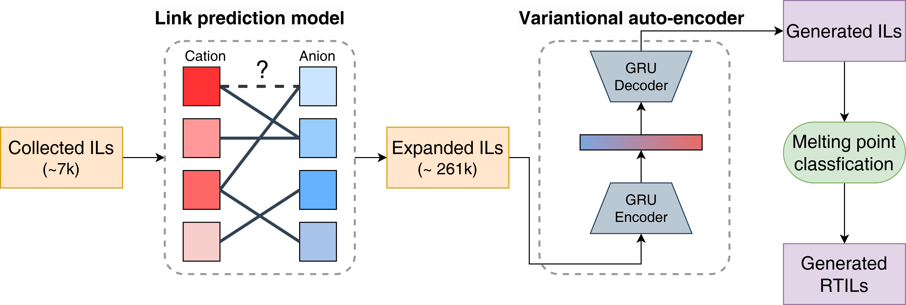

# Generate ionic liquids with low-melting points



## Installation
1. Please follow the installation part [here](https://github.com/fate1997/MoIma) to install `moima`, which is for VAE generation.
2. Clone this repository:
```bash
git clone https://github.com/fate1997/ILGen-overall.git
cd ILGen-overall
```

## Training
This project including three parts:
1. Expand the collected IL database by link prediction.
```
python step1_link_prediction/run.py
```
2. Train a VAE model to generate ILs.
```
python step2_vae_generation/train_vae.py
```
3. Train a melting point classification model for post-filtering.
```
python step3_post_filtering/train_logistic.py
```

**I have also include the pre-trained models under each folder. So you can skip the above process if you just want to sample new ILs**

## Sampling
You can sample new ILs by running the following command:
```
python sample.py